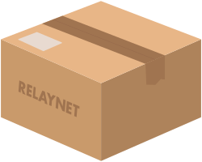

# Relaynet

Relaynet will be the computer network on which humankind can truly rely, and the first order of business is to restore connectivity in regions where the Internet has been cut off due to natural or human causes. No new hardware required.

There will also be benefits to using Relaynet apps when the Internet is available. For instance, such apps can be free of spam and phishing -- with no artificial intelligence or human intervention. [Learn more about how Relaynet will solve real problems](./users).

If you're a software vendor, Relaynet can do more than making your apps resilient: You could reduce costs while building innovative products that offer better security and privacy to your users. [Learn more](./software-vendors).

If you're interested in restoring connectivity when the Internet is cut off, [become a courier](./couriers). Do it for profit, the greater good or both.

Relaynet is a decentralized technology with [technical specifications](https://specs.relaynet.network/) publicly available and [open source implementations](https://github.com/relaycorp). It was invented at the University of Oxford and its development is now led by [Relaycorp](https://relaycorp.tech/), a company founded by Relaynet's author to ensure the network realizes its full potential. The initial implementation is currently funded by the [Open Technology Fund](https://www.opentech.fund/). [Learn more about Relaynet](./about).
