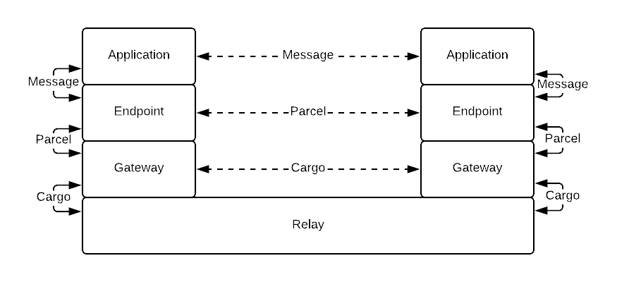

_Note: This is a working draft._

Relaynet is an [asynchronous messaging](https://www.techopedia.com/definition/26454/asynchronous-messaging) protocol suite that will make it possible to relay data outside the Internet, via [sneakernets](https://en.wikipedia.org/wiki/Sneakernet) or wireless systems, using end-to-end encryption. 

To achieve this, it provides the basis for making existing and future software tolerant to large latencies by helping them adopt an asynchronous messaging pattern -- as opposed to the Remote Procedure Call (RPC) pattern that HTTP-based APIs depend on, which assumes a reliable connection.

The architecture draws heavily on the fields of [Delay-Tolerant Networking](https://en.wikipedia.org/wiki/Delay-tolerant_networking) and cryptography, and builds on pre-existing standards and technologies where possible, such as [X.509](https://en.wikipedia.org/wiki/X.509) and the [Cryptographic Message Syntax (CMS)](https://en.wikipedia.org/wiki/Cryptographic_Message_Syntax).

Relaynet is also the name of the [overlay](https://en.wikipedia.org/wiki/Overlay_network), [store-and-forward](https://en.wikipedia.org/wiki/Store_and_forward), [onion](https://en.wikipedia.org/wiki/Onion_routing) network resulting from the protocol suite.

## Concepts

- A **service** is a collection of _applications_ that communicate amongst themselves. A service can be centralized (client-server) or decentralized (peer-to-peer).
- **Applications** exchange _messages_ amongst themselves, and because they can't communicate directly, they each use an _endpoint_ as a broker.
- A **message** is serialized in the format determined by the service and doesn't have to be encrypted or signed.
- An **endpoint** receives a message from its application and converts it into a _parcel_ for the target application's endpoint, and because they still can't communicate directly, they each use a _gateway_ as a broker. When an endpoint receives a parcel from the gateway, it has to decrypt the message and pass it to its application.
- A **parcel** encapsulates a message by encrypting it with the target endpoint's certificate and signing it with the origin endpoint's key.
- A **gateway** receives parcels from endpoints and puts them into cargo for another gateway, using a _relayer_ as a broker. When a gateway receives cargo from a relayer, it decrypts the parcels and delivers them to their corresponding target endpoints.
- A **cargo** encapsulates one or more parcels
- A **relayer** _relays_ cargo from one gateway to one or more gateways.

For example, if Twitter supported Relaynet, Twitter would be the _service_, the Twitter mobile apps would be _applications_, the Twitter API would also be an _application_. The _endpoints_ in the mobile apps could simply be Java (Android) or Swift (iOS) libraries, whilst the _endpoint_ in the Twitter API could be a new API endpoint (e.g., `https://api.twitter.com/relaynet`).

## Protocols

Unlike RPC, messaging is peer-to-peer: Any node can reach any node if it has the target node's address and authorization to do so.

The picture below shows the interaction amongst nodes in Relaynet:

## Addressing

TODO
