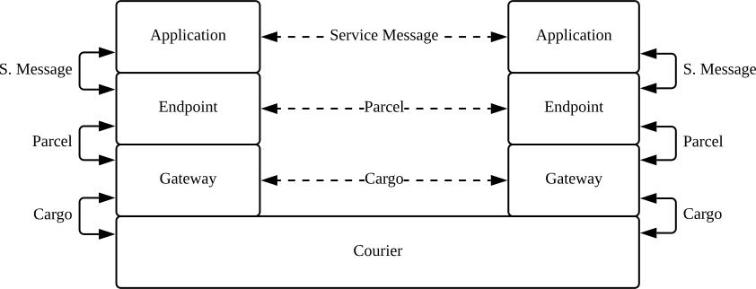

# Technical overview of Awala

This is an introduction to Awala aimed at a diverse audience with at least a basic understanding of networking and cryptography, such as:

- Human rights organisations or [software vendors]() assessing the security of the network.
- Security auditors starting an assessment of the specs or the reference implementations.
- Developers contributing to the reference implementations.

If you're looking for a less technical introduction, you may prefer to read [how Awala works in simple terms]() instead.

We highly recommend familiarising yourself with the way Awala works from the end user's perspective before reading this document. If you haven't done so already, try it out with [Letro](https://letro.app/en/) or [Awala Ping](https://play.google.com/store/apps/details?id=tech.relaycorp.ping), or watch the [demo video](https://youtu.be/LL1Z9EGiMVc).

## Introduction

Awala is a [delay-tolerant](https://en.wikipedia.org/wiki/Delay-tolerant_networking), [overlay](https://en.wikipedia.org/wiki/Overlay_network) network: It runs on top of the Internet when it's available, but it can switch to a secure [sneakernet](https://en.wikipedia.org/wiki/Sneakernet) when the Internet is unavailable. With and without the Internet, users get end-to-end encryption and [pseudonymity](https://www.techtarget.com/whatis/definition/pseudonymity).

App developers can make existing Internet-based services (e.g., social networks) work on Awala, or build Awala-native apps that unlock additional benefits (e.g., spam protection, decentralisation).

The network itself is decentralised -- or, more precisely, it's _federated_: End user devices must be paired with an [_Awala-Internet Gateway_](https://docs.relaycorp.tech/awala-gateway-internet/), which is a server that relays messages between its users and other Awala-compatible Internet hosts. By default, users are paired with a [gateway operated by Relaycorp](https://github.com/relaycorp/cloud-gateway/) (e.g., `frankfurt.relaycorp.cloud`), but this can be changed.

For example, the following video illustrates how Alice would post the message "Hi!" on Facebook via Awala whilst she's connected to the Internet -- assuming that Meta or a third party has built an Awala-compatible Facebook app for Android:



In the hypothetical scenario above, the Facebook Android app would produce a JSON document containing Alice' post, and it'd send it to the [Awala Gateway for Android](https://play.google.com/store/apps/details?id=tech.relaycorp.gateway) using the [Awala endpoint library](https://github.com/relaycorp/awala-endpoint-android). Internally, this library wraps that JSON document in an Awala _parcel_, which is encrypted with the public key of Facebook's [Awala endpoint middleware](https://docs.relaycorp.tech/awala-endpoint-internet/). Next, Alice' Awala Gateway for Android sends the parcel to its Internet peer (`frankfurt.relaycorp.cloud` in this case), which then passes the parcel on to Facebook's Internet endpoint (e.g., `awala.facebook.com`). Finally, Facebook's endpoint middleware verifies and decrypts the parcel, and forwards the encapsulated JSON document to the Facebook app server.

Conversely, when the Facebook app server wants to send a message to a user, it first sends the message to its middleware, which wraps it into a parcel and then sends it to the user's Internet gateway. The Internet gateway then forwards the parcel to the user's gateway, which forwards the parcel to the Facebook app. Finally, the Facebook app verifies and decrypts the parcel using the endpoint library, and processes the encapsulated data. The following video builds on the previous example to illustrate this scenario:



Note that in the animation above, Bob is using a different Internet gateway (`london.relaycorp.cloud`) than Alice (`frankfurt.relaycorp.cloud`). As a federated network, users can choose their own Internet gateway independently of the service they use and the people they communicate with -- Think of it as the Awala equivalent of an ISP.

## Sneakernet

When the Internet is unavailable, users can have their data physically transported by [couriers](), who effectively form a secure sneakernet.

Most of the protocol remains the same as when the Internet is available, but gateways don't exchange parcels: instead, they exchange _cargo_, which is also encrypted and contains one or more parcels. This way, an eavesdropper wouldn't be able to see which services are being used (e.g., `awala.facebook.com`). The following video illustrates the transport of cargo to the Internet:



Collecting cargo from the Internet gateway is almost the same process in reverse, except that the courier must start by providing a _Cargo Collection Authorisation_ (CCA), which the user's private gateway would've issued to the courier when they synchronised. The CCA is encrypted with the Internet gateway's public key, and it contains the _Cargo Delivery Authorisation_ (see [delivery authorisations](#delivery-authorisations) below) that the Internet gateway must use to sign the cargo.

## Messaging

Both parcels and cargoes are serialised using the [Awala Abstract Message Format](https://specs.awala.network/RS-001) (_RAMF_ for historic reasons), which is a binary format based on [ASN.1 Distinguished Encoding Rules](https://www.itu.int/rec/T-REC-X.680-X.693-201508-I/en) (DER) and the [Cryptographic Message Syntax](https://tools.ietf.org/html/rfc5652) (CMS). The protocol suite defines additional RAMF types.

A RAMF message is a [CMS `SignedData`](https://datatracker.ietf.org/doc/html/rfc5652#section-5) message that encapsulates the following in a DER-encoded structure:

- The recipient's [address](https://specs.awala.network/RS-000#addressing), which has two fields:
  - Its [_node id_](#node-ids).
  - The _Internet address_ of its Internet gateway (e.g., `frankfurt.relaycorp.cloud`; if the recipient is a private endpoint or an Internet gateway) or its Internet endpoint (e.g., `facebook.com` as a pointer to `awala.facebook.com`). This field is absent in cargo bound for a private gateway.
- The parcel id: A unique identifier for the parcel, used to drop duplicates for the same sender/recipient pair.
- The creation and expiry dates. Used to purge invalid messages.
- The ciphertext of the encapsulated content, using a [CMS `EnvelopedData`](https://datatracker.ietf.org/doc/html/rfc5652#section-6) structure.

Additionally, the `SignedData` structure contains the sender's certificate, which will be self-issued if the recipient is an [Internet node](#internet-nodes). If the recipient is [private](#private-nodes), the sender will have to sign the message with the appropriate [Delivery Authorisation](#delivery-authorisations), or else the network will drop the message.

Note that the unencrypted metadata above doesn't include any personally-identifiable information. Additionally, only parcels bound for an Internet endpoint can be attributed to a specific service (e.g., `awala.facebook.com`), which is something that only the gateways that relay the parcels can see -- couriers can't see that because parcels are encapsulated in cargo.

### Messaging protocols

Awala involves three layers of [messaging protocols](https://specs.awala.network/RS-000#messaging-protocols),
with each powering a different _channel_:

- **Service Messaging Protocol** (_service channel_): This is entirely defined by the Awala service provider. The service provider is free to define the types of messages it supports, and how they're serialised (e.g., JSON, Protocol Buffers). The service provider will also be responsible for their validation. Building on the examples above, one of the messages that Facebook could define is a `Post`, which could be a JSON document containing the fields `date` and `text`. 
- **Endpoint Messaging Protocol** (_endpoint channel_): This protocol is part of the Awala suite, and is implemented in the endpoint libraries (e.g., [Android](https://github.com/relaycorp/awala-endpoint-android)) and the [endpoint middleware](https://docs.relaycorp.tech/awala-endpoint-internet/). This is the layer where service messages are encapsulated in parcels.
- **Gateway Messaging Protocol** (_gateway channel_): This protocol is also part of the Awala suite, and is implemented by all Awala gateways ([Internet](https://docs.relaycorp.tech/awala-gateway-internet/), [desktop](https://github.com/relaycorp/awala-gateway-desktop) and [Android](https://github.com/relaycorp/relaynet-gateway-android)). This is the layer where parcels are encapsulated in cargoes.

The following diagram illustrates the relationship between the three layers when the sneakernet is used:

### Message transport bindings

The messaging protocols don't actually specify _how_ endpoints, gateways and couriers exchange messages: That's deferred to the [_message transport bindings_](https://specs.awala.network/RS-000#message-transport-bindings). Awala defines three bindings:

- **Gateway Synchronisation Binding**: It defines how a private gateway communicates with its Internet gateway when the Internet is available, and how private endpoints communicate with their private gateway. The primary objective is to exchange parcels, but other operations are also defined here (e.g., registration).
- **Cargo Relay Binding**: It defines how gateways and couriers exchange cargo when the sneakernet is used.
- **Parcel Delivery Binding**: It defines how Internet gateways and Internet endpoints exchange parcels.

Bindings are _abstract_, in the sense that the protocol is agnostic of the underlying Layer 7 protocol. As of this writing, we support one concrete binding for each abstract binding:

- **Gateway synchronisation**: [Parcel Delivery over HTTP and WebSockets (PoWeb)](https://specs.awala.network/RS-016), which is mostly implemented in [Kotlin](https://github.com/relaycorp/awala-poweb-jvm) and [JS](https://github.com/relaycorp/relaynet-poweb-js) libraries that gateways and private endpoints integrate.
- **Cargo relay**: [Cargo Relay over gRPC (CogRPC)](https://specs.awala.network/RS-008), which is mostly implemented in [Kotlin](https://github.com/relaycorp/awala-cogrpc-jvm) and [JS](https://github.com/relaycorp/relaynet-cogrpc-js) libraries that the gateways and courier apps integrate.
- **Parcel delivery**: [Parcel Delivery over HTTP (PoHTTP)](https://specs.awala.network/RS-007), which is mostly implemented in a [JS library](https://github.com/relaycorp/relaynet-pohttp-js) that Internet gateways and Internet endpoints integrate.

When a client connects to a remote server (i.e., not on `127.0.0.1`), Awala requires TLS 1.2+ to be used. Cleartext HTTP or SSL connections must be rejected. DTLS 1.2+ is allowed in case a future binding uses UDP.

## Nodes

_Nodes_ are entities that produce and consume messages. Endpoints and gateways are nodes, but couriers are not.

Nodes can currently be private or Internet, depending on whether they're Internet hosts. Future versions of the network may introduce additional node types as new underlying networks (e.g., [scatternets](https://en.wikipedia.org/wiki/Scatternet)) are supported.

### Private nodes

Private endpoints and private gateways, collectively known as _private nodes_, run on end user devices (e.g., smartphones, laptops) and implement a subset of the bindings:

- Private endpoints implement the gateway synchronisation binding (as a client).
- Private gateways implement the gateway synchronisation binding (as a client and a server) and the cargo relay binding (as a client). The gateway synchronisation server must not be reachable from other devices, so it must listen on `127.0.0.1` or use UNIX sockets; the reference implementations use `127.0.0.1`.

Awala requires every message bound for a private node to be signed with an appropriate [Delivery Authorisation](#delivery-authorisations).

### Internet nodes

Internet gateways and Internet endpoints, collectively known as _Internet nodes_, are Internet hosts that implement one or more bindings:

- Internet endpoints implement the parcel delivery binding (as a client and a server).
- Internet gateways implement the gateway synchronisation binding (as a client and a server), the parcel delivery binding (as a client and a server) and the cargo relay binding (as a server). However, an operator may decide to disable the cargo relay binding if they don't want to support the sneakernet.

Awala requires that such hosts have an `SRV` record to "advertise" its role as an Internet node. For example, building on the example above, Facebook could deploy its endpoint middleware at `awala.facebook.com` (using an `A` or `CNAME` record), and then have an `SRV` record pointing to it from `facebook.com` (in which case, `facebook.com` would be its Internet address). This `SRV` record must be in an DNSSEC-signed zone.

Additionally, clients connecting to Awala Internet nodes must use DNS-over-HTTPS (DoH) or DNS-over-TLS (DoT) to resolve the both records for privacy and censorship-circumvention reasons. As of this writing, the reference implementations use [Cloudflare's DoH service](https://developers.cloudflare.com/1.1.1.1/encryption/dns-over-https/).

Unlike private nodes, Internet nodes do not benefit from any type of access control like [Delivery Authorisations](#delivery-authorisations).

## Authentication and access control

Awala deploys its own [Public Key Infrastructure](https://specs.awala.network/RS-002) (PKI) to completely protect private nodes from spam and minimise illegitimate traffic on the sneakernet (where the storage capacity may be limited). The PKI is based on [X.509](https://en.wikipedia.org/wiki/X.509) certificates, and it's used to authenticate all nodes.

### Identity keys

Every node has a long-term, _identity key pair_ that's used to issue certificates (e.g., [delivery authorisations](#delivery-authorisations)) and sign [RAMF messages](#messaging).

Nodes use 2028-bit RSA keys by default, but 3072- and 4096-bit keys are also supported. Digital signatures are produced with the [Probabilistic Signature Scheme](https://en.wikipedia.org/wiki/Probabilistic_signature_scheme) (RSA-PSS), and SHA-256 by default (SHA-384 and SHA-512 are also supported).

[We plan to migrate to Curve25519/Curve448 keys and EdDSA in the future](https://github.com/AwalaApp/specs/issues/21).

### Node ids

The id of a node is the SHA-256 hash of its public key, hex-encoded, and prefixed with a zero (`0`; denoting the first version of this format). For example, `0b5bb9d8014a0f9b1d61e21e796d78dccdf1352f23cd32812f4850b878ae4944c` would be the id of a node whose identity public key has the SHA-256 digest `b5bb9d8014a0f9b1d61e21e796d78dccdf1352f23cd32812f4850b878ae4944c`.

### Delivery Authorisations

A delivery authorisation is a certificate whereby a private node authorises another node (private or Internet) to send messages to it. There are two types of authorisations:

- **Parcel Delivery Authorisation** (PDA): It's granted by a private endpoint to another endpoint (private or Internet). A parcel signed with a PDA must also include the following intermediate certificates:
  1. The recipient of the parcel, which issued the PDA.
  2. The recipient's private gateway.
- **Cargo Delivery Authorisation** (CDA): It's granted by a private gateway to its Internet gateway. A cargo signed with a CDA must also include the certificate for the recipient, which issued the CDA.

With the appropriate certificate chain attached to each message, the gateways and couriers transporting the message can verify whether the sender is authorised to communicate with the recipient.

## End-to-end encryption

The end-to-end encryption scheme -- known as the [Awala Channel Session Protocol](https://specs.awala.network/RS-003) -- is used to encrypt the content of [RAMF messages](#messaging) with perfect forward secrecy, [future secrecy](https://signal.org/blog/advanced-ratcheting/) and replay attack mitigation. It's mostly a delay-tolerant, decentralised version of the [X3DH](https://signal.org/docs/specifications/x3dh/) and [Double Ratchet](https://signal.org/docs/specifications/doubleratchet/) protocols from the Signal project.

Another key difference is that X3DH requires X25519 or X448 keys, whereas Awala uses NIST curves (P-256 by default) due to the fact that one of our third-party dependencies doesn't support X25519 or X448. However, [we plan to migrate to X25519/X448 in the future](https://github.com/AwalaApp/specs/issues/21). The following algorithms are also used:

- **Symmetric ciphers**: AES-128 by default, but AES-192 and AES-256 are also supported. AES-KW is used when encrypting cryptographic key material in CMS `EnvelopedData` structures, and AES-GCM for the payload.
- **Key derivation functions**: Key Derivation Function (KDF) from ANSI X9.63. We plan to migrate to the HMAC-based Extract-and-Expand Key Derivation Function (HKDF), but [this is currently unsupported by a dependency](https://github.com/PeculiarVentures/PKI.js/issues/254).

Internet nodes have an initial ECDH key pair, whose public key is made available to prospective peers via the [connection parameters](#connection-parameters). Because the Channel Session Protocol uses a ratchet mechanism, the initial key pair is only used by private nodes to encrypt the first message sent to an Internet peer, and subsequent messages will use different key pairs. The initial key pair is rotated periodically.

## Connection parameters

Since establishing a channel between two nodes requires two public keys (a long-term identity key and a short-term encryption key) and an Internet address from each peer, Awala facilitates this process by having nodes exchange their _connection parameters_ (a binary blob) with prospective peers.

### Internet node connection parameters

Internet endpoints and Internet gateways expose their connection parameters via their parcel delivery and gateway synchronisation [bindings](#message-transport-bindings), respectively. Such parameters are:

- The Internet address of the node (e.g., `frankfurt.relaycorp.cloud`).
- The identity public key of the node.
- The initial ECDH public key of the node.

Connections parameters are safe to distribute publicly. In fact, we at Relaycorp distribute our private nodes with their public peers' connection parameters embedded in the software so that they won't need to be fetched from the Internet. For example:

- The Awala Gateway for Android has the [connection parameters for the gateway `frankfurt.relaycorp.cloud`](https://github.com/relaycorp/relaynet-gateway-android/blob/9ed06f48008aa2be56d42b8ab4f34e7764d2ae81/app/src/main/res/raw/public_gateway_cert.der).
- The Awala Ping for Android has the [connection parameters for the endpoint `ping.awala.services`](https://github.com/relaycorp/awala-ping-android/blob/4ab494bde91ec0a86d6c7b2afa323a02b7543b92/app/src/main/res/raw/default_public_peer_connection_params.der).
- Letro has the [connection parameters for the endpoint `letro.app`](https://github.com/relaycorp/letro-android/blob/4933156fd112d984e8874f55dfb86aab10efd194/app/src/main/res/raw/server_connection_params.der).

### Private node connection parameters

In the case of private endpoints, the connection parameters is known as _connection authorisation_, since its primary purpose is to authorise peers. This binary blob extends the Internet node connection parameters with the PDA for the grantee and the relevant intermediate certificates. Consequently, each authorisation is unique to a particular endpoint.

Private gateways do not have connection parameters. Instead, they use Cargo Delivery Authorisations to authorise their Internet gateways, and the private gateway's latest ECDH public key is already shared with the Internet gateway in the CMS `EnvelopedData` structure encapsulated in the cargo.

## Key management

Internet nodes use [Key Management Services (KMSs) via a provider-agnostic library](https://www.npmjs.com/package/@relaycorp/webcrypto-kms). In Relaycorp's case, all of our keys are backed by Hardware Security Modules (HSMs) in [Google Cloud KMS](https://cloud.google.com/kms). Unfortunately, for encryption keys, we have to protect them with envelope encryption because [ECDH keys are not natively supported yet](https://issuetracker.google.com/issues/231334600).

Private nodes on Android use the [Android Keystore](https://developer.android.com/training/articles/keystore), whilst [desktop nodes currently store the keys in cleartext](https://github.com/relaycorp/awala-gateway-desktop/issues/441).

## Certificate management

The Awala PKI requires certificates to be valid for no more than 6 months to compensate for the lack of a revocation mechanism (which wouldn't work when the Internet is unavailable).

Certificate renewal is fully automated:

- Internet gateways renew their certificates every 3 months, and are valid for 6 months.
- Internet endpoints always use self-issued certificates, so they're ephemeral.
- Private gateways and private endpoints renew their certificates 3 months before they expire.
- PDAs are renewed and sent automatically before the old ones expire, as long as the granting endpoint has not revoked the PDA.
- CDAs are always issued on each courier synchronisation.

## Service (de)centralisation

Awala services can be centralised, decentralised or hybrid. The examples so far illustrate a centralised service, where Facebook (the service provider) operates an Internet endpoint, which processes all the communication between users. However, it's also possible to build decentralised services where Awala gateways transport parcels between users, with no involvement from a server operated by the service provider.

For example, the following video illustrates how Alice could send the message “Hi!” to Bob on WhatsApp via Awala whilst she’s connected to the Internet – assuming that Meta or a third party has built an Awala-compatible WhatsApp app for Android:



In this example, Alice and Bob are using different Internet gateways, but if they were using the same gateway, the process would be a bit simpler as there would be one fewer hop as shown in the following video:



## Ping service

Awala defines a trivial service called [Ping](https://specs.awala.network/RS-014), which is used to test the network itself. The service has private endpoint apps on [Android](https://github.com/relaycorp/awala-ping-android) and [desktop](https://github.com/relaycorp/awala-ping-desktop), and [a backend app for the Internet endpoint middleware](https://github.com/relaycorp/awala-pong).

## Learn more

If you wish to learn more, you can read the [Awala specs](https://specs.awala.network/), browse the [reference implementations](https://github.com/search?q=topic%3Aawala+org%3Arelaycorp) or [ask us questions](https://github.com/orgs/AwalaApp/discussions).
